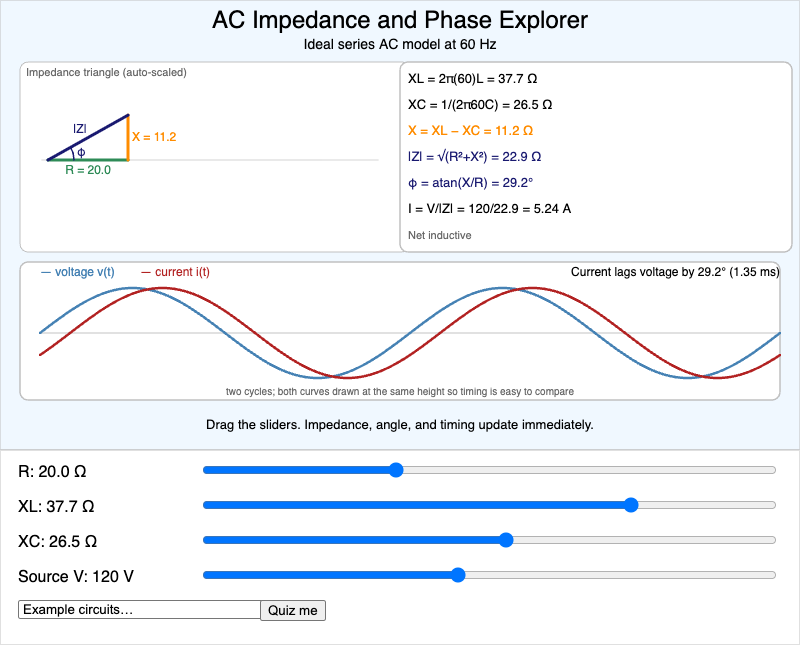
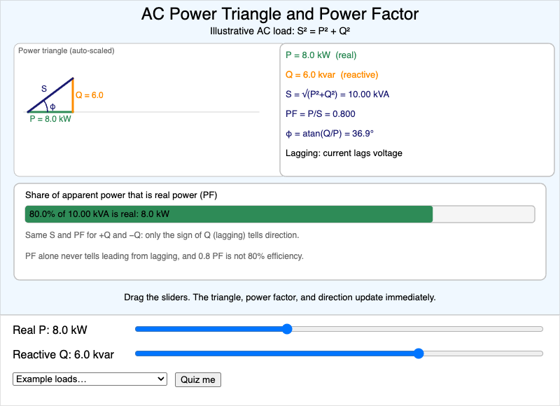
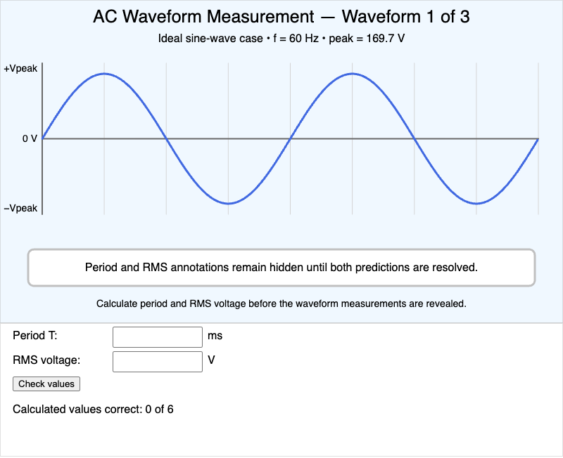
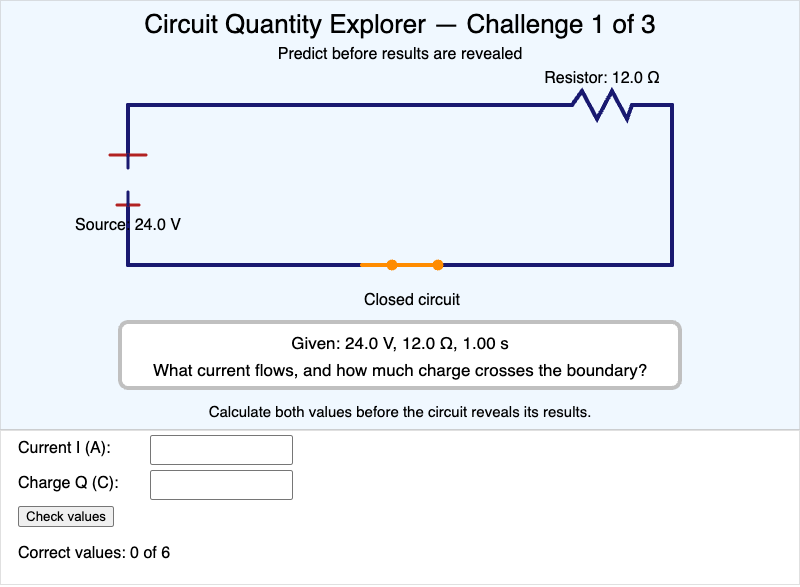
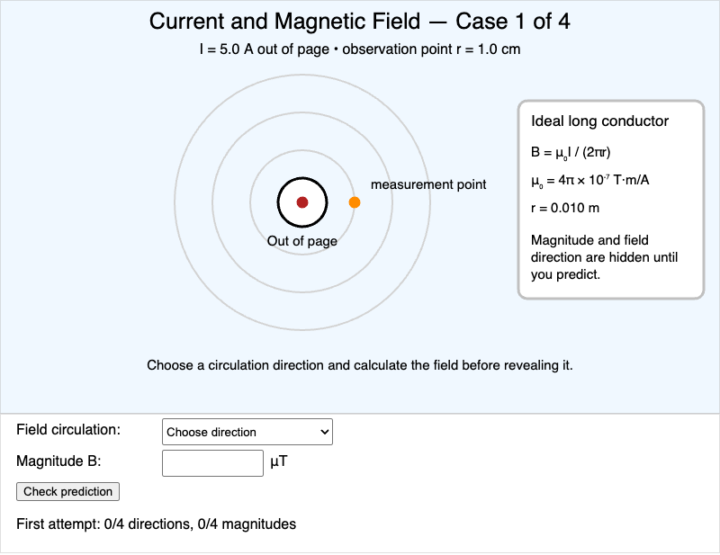
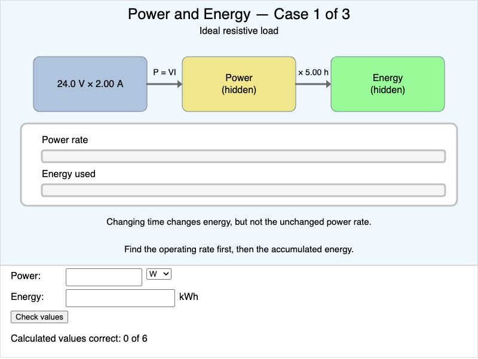
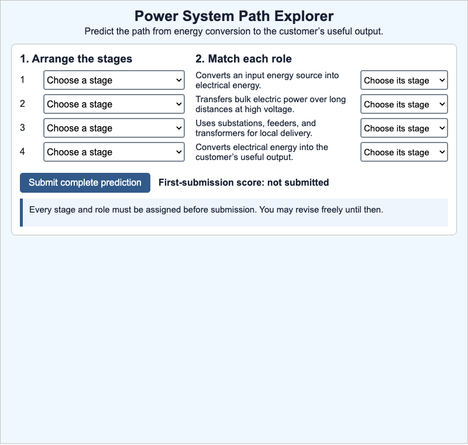

# MicroSims

This book includes **9 interactive MicroSims** — self-contained, browser-based visualizations you can explore directly. Click any thumbnail to open the MicroSim.

<!-- This gallery is generated by generate-sims-index.py — edits here will be overwritten. -->

  <a href="ac-impedance-phase-explorer/" title="AC Impedance and Phase Explorer" style="display:block;border:1px solid #e3e7ec;border-radius:8px;overflow:hidden;text-decoration:none;color:inherit;box-shadow:0 1px 3px rgba(0,0,0,0.08);">AC Impedance and Phase Explorer</a>
  <a href="ac-power-triangle-calculator/" title="AC Power Triangle and Power Factor Calculator" style="display:block;border:1px solid #e3e7ec;border-radius:8px;overflow:hidden;text-decoration:none;color:inherit;box-shadow:0 1px 3px rgba(0,0,0,0.08);">AC Power Triangle and Power Factor Calculator</a>
  <a href="ac-waveform-measurement-explorer/" title="AC Waveform Measurement Explorer" style="display:block;border:1px solid #e3e7ec;border-radius:8px;overflow:hidden;text-decoration:none;color:inherit;box-shadow:0 1px 3px rgba(0,0,0,0.08);">AC Waveform Measurement Explorer</a>
  <a href="circuit-quantity-explorer/" title="Circuit Quantity Explorer" style="display:block;border:1px solid #e3e7ec;border-radius:8px;overflow:hidden;text-decoration:none;color:inherit;box-shadow:0 1px 3px rgba(0,0,0,0.08);">Circuit Quantity Explorer</a>
  <a href="current-magnetic-field-explorer/" title="Current and Magnetic Field Explorer" style="display:block;border:1px solid #e3e7ec;border-radius:8px;overflow:hidden;text-decoration:none;color:inherit;box-shadow:0 1px 3px rgba(0,0,0,0.08);">Current and Magnetic Field Explorer</a>
  <a href="electrical-power-energy-calculator/" title="Electrical Power and Energy Calculator" style="display:block;border:1px solid #e3e7ec;border-radius:8px;overflow:hidden;text-decoration:none;color:inherit;box-shadow:0 1px 3px rgba(0,0,0,0.08);">Electrical Power and Energy Calculator</a>
  <a href="graph-viewer/" title="Learning Graph Viewer" style="display:block;border:1px solid #e3e7ec;border-radius:8px;overflow:hidden;text-decoration:none;color:inherit;box-shadow:0 1px 3px rgba(0,0,0,0.08);">no previewLearning Graph Viewer</a>
  <a href="power-system-path-explorer/" title="Power System Path Explorer" style="display:block;border:1px solid #e3e7ec;border-radius:8px;overflow:hidden;text-decoration:none;color:inherit;box-shadow:0 1px 3px rgba(0,0,0,0.08);">Power System Path Explorer</a>
  <a href="rms-explorer/" title="RMS Explorer" style="display:block;border:1px solid #e3e7ec;border-radius:8px;overflow:hidden;text-decoration:none;color:inherit;box-shadow:0 1px 3px rgba(0,0,0,0.08);">no previewRMS Explorer</a>

